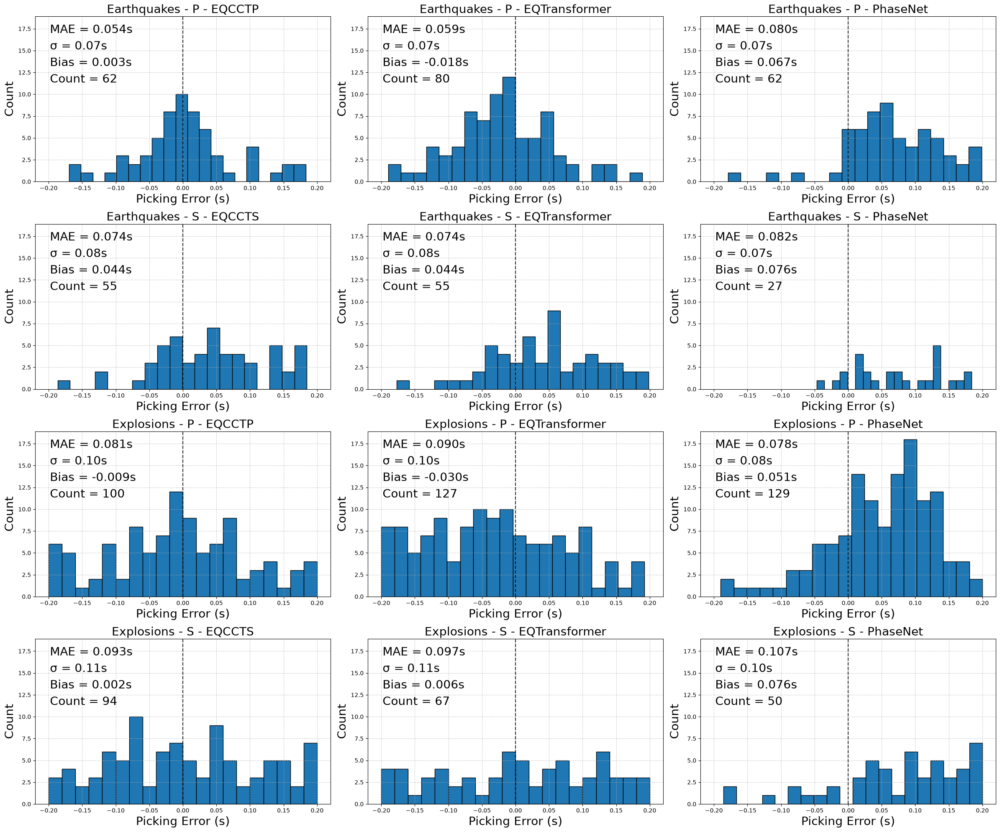

# Performance of pretrained models

This report compares the performance of EQCCT(P/S), EQTransformer, and PhaseNet models as-is from Seisbench.

## Dataset
The number of 3-component waveforms used for each class:
* Earthquakes: 288 waveforms
* Explosions: 699 waveforms
* Noise: 1278 waveforms

The Finnish dataset has randomised window start times and downsamples high frequency waveforms (>100Hz) to 100 Hz. 

The validation (dev) split was used for this report.

## Earthquakes P-phase picking
| Model         | Event Type   | Phase   |   Threshold |   Count | Precision   | Recall    | F1        | Coverage   | MAE       |         Bias |   TP |   TN |   FP |   FN |
|:--------------|:-------------|:--------|------------:|--------:|:------------|:----------|:----------|:-----------|:----------|-------------:|-----:|-----:|-----:|-----:|
| EQCCTP        | earthquakes  | P       |         0.2 |     288 | **1.000**   | 0.215     | 0.354     | 0.215      | **0.054** |   0.00320385 |   62 |    0 |    0 |  226 |
| EQCCTS        | earthquakes  | P       |         0.2 |     288 | 0.000       | 0.000     | 0.000     | 0.000      | nan       | nan          |    0 |    0 |    0 |  288 |
| EQTransformer | earthquakes  | P       |         0.2 |     288 | **1.000**   | **0.278** | **0.435** | **0.278**  | 0.059     |  -0.0177636  |   80 |    0 |    0 |  208 |
| PhaseNet      | earthquakes  | P       |         0.2 |     288 | **1.000**   | 0.215     | 0.354     | 0.215      | 0.080     |   0.067258   |   62 |    0 |    0 |  226 |


## Earthquakes S-phase picking
| Model         | Event Type   | Phase   |   Threshold |   Count | Precision   | Recall    | F1        | Coverage   | MAE       |        Bias |   TP |   TN |   FP |   FN |
|:--------------|:-------------|:--------|------------:|--------:|:------------|:----------|:----------|:-----------|:----------|------------:|-----:|-----:|-----:|-----:|
| EQCCTP        | earthquakes  | S       |         0.2 |     288 | 0.000       | 0.000     | 0.000     | 0.000      | nan       | nan         |    0 |    0 |    0 |  288 |
| EQCCTS        | earthquakes  | S       |         0.2 |     288 | **1.000**   | **0.191** | **0.321** | **0.191**  | **0.074** |   0.0443978 |   55 |    0 |    0 |  233 |
| EQTransformer | earthquakes  | S       |         0.2 |     288 | **1.000**   | **0.191** | **0.321** | **0.191**  | **0.074** |   0.0439423 |   55 |    0 |    0 |  233 |
| PhaseNet      | earthquakes  | S       |         0.2 |     288 | **1.000**   | 0.094     | 0.171     | 0.094      | 0.082     |   0.0756918 |   27 |    0 |    0 |  261 |


## Explosions P-phase picking
| Model         | Event Type   | Phase   |   Threshold |   Count | Precision   | Recall    | F1        | Coverage   | MAE       |         Bias |   TP |   TN |   FP |   FN |
|:--------------|:-------------|:--------|------------:|--------:|:------------|:----------|:----------|:-----------|:----------|-------------:|-----:|-----:|-----:|-----:|
| EQCCTP        | explosions   | P       |         0.2 |     699 | **1.000**   | 0.143     | 0.250     | 0.143      | 0.081     |  -0.00940301 |  100 |    0 |    0 |  599 |
| EQCCTS        | explosions   | P       |         0.2 |     699 | 0.000       | 0.000     | 0.000     | 0.000      | nan       | nan          |    0 |    0 |    0 |  699 |
| EQTransformer | explosions   | P       |         0.2 |     699 | **1.000**   | 0.182     | 0.308     | 0.182      | 0.090     |  -0.0300877  |  127 |    0 |    0 |  572 |
| PhaseNet      | explosions   | P       |         0.2 |     699 | **1.000**   | **0.185** | **0.312** | **0.185**  | **0.078** |   0.0505174  |  129 |    0 |    0 |  570 |


## Explosions S-phase picking
| Model         | Event Type   | Phase   |   Threshold |   Count | Precision   | Recall    | F1        | Coverage   | MAE       |         Bias |   TP |   TN |   FP |   FN |
|:--------------|:-------------|:--------|------------:|--------:|:------------|:----------|:----------|:-----------|:----------|-------------:|-----:|-----:|-----:|-----:|
| EQCCTP        | explosions   | S       |         0.2 |     699 | 0.000       | 0.000     | 0.000     | 0.000      | nan       | nan          |    0 |    0 |    0 |  699 |
| EQCCTS        | explosions   | S       |         0.2 |     699 | **1.000**   | **0.134** | **0.237** | **0.134**  | **0.093** |   0.00244148 |   94 |    0 |    0 |  605 |
| EQTransformer | explosions   | S       |         0.2 |     699 | **1.000**   | 0.096     | 0.175     | 0.096      | 0.097     |   0.00644075 |   67 |    0 |    0 |  632 |
| PhaseNet      | explosions   | S       |         0.2 |     699 | **1.000**   | 0.072     | 0.134     | 0.072      | 0.107     |   0.076482   |   50 |    0 |    0 |  649 |


## Noise P-phase picking
| Model         | Event Type   | Phase   |   Threshold |   Count |   Precision |   Recall |   F1 | Coverage   |   MAE |   Bias |   TP |   TN |   FP |   FN |
|:--------------|:-------------|:--------|------------:|--------:|------------:|---------:|-----:|:-----------|------:|-------:|-----:|-----:|-----:|-----:|
| EQCCTP        | noise        | P       |         0.2 |    1278 |           0 |        0 |    0 | 0.005      |   nan |    nan |    0 | 1272 |    6 |    0 |
| EQCCTS        | noise        | P       |         0.2 |    1278 |           0 |        0 |    0 | **0.0**    |   nan |    nan |    0 | 1278 |    0 |    0 |
| EQTransformer | noise        | P       |         0.2 |    1278 |           0 |        0 |    0 | 0.002      |   nan |    nan |    0 | 1276 |    2 |    0 |
| PhaseNet      | noise        | P       |         0.2 |    1278 |           0 |        0 |    0 | 0.027      |   nan |    nan |    0 | 1243 |   35 |    0 |


## Noise S-phase picking
| Model         | Event Type   | Phase   |   Threshold |   Count |   Precision |   Recall |   F1 | Coverage   |   MAE |   Bias |   TP |   TN |   FP |   FN |
|:--------------|:-------------|:--------|------------:|--------:|------------:|---------:|-----:|:-----------|------:|-------:|-----:|-----:|-----:|-----:|
| EQCCTP        | noise        | S       |         0.2 |    1278 |           0 |        0 |    0 | **0.0**    |   nan |    nan |    0 | 1278 |    0 |    0 |
| EQCCTS        | noise        | S       |         0.2 |    1278 |           0 |        0 |    0 | 0.012      |   nan |    nan |    0 | 1263 |   15 |    0 |
| EQTransformer | noise        | S       |         0.2 |    1278 |           0 |        0 |    0 | 0.002      |   nan |    nan |    0 | 1276 |    2 |    0 |
| PhaseNet      | noise        | S       |         0.2 |    1278 |           0 |        0 |    0 | 0.025      |   nan |    nan |    0 | 1246 |   32 |    0 |


## Pick Errors



## Conclusion
At a threshold of 0.2s, **EQTransformer** outperforms the other models in earthquake P and S-picking. For other event-type-phase splits, it was was the second-best model whose performance was almost identical to the best model, save for explosion S-picks where there is a significant gap with the best model, EQCCT. At the moment, **EQTransformer** seems to be the ideal candidate for finetuning.

Caveat: Phasenet was trained on windows of 3001 samples but in this benchmarking, it carried out inference on waveforms of 6000 samples which could explain poorer performance.

## Code for reproduction
```python
import seisbench.data as sbd

import os
from pathlib import Path
import utils.train_utils as tutils
import utils.model_utils as mutils

DIR_DATA = Path(os.getcwd()) / "data"

# Load the train validation and test splits
dataset = sbd.WaveformDataset(DIR_DATA)
train_dataset, dev_dataset, test_dataset = dataset.train_dev_test()

# Load pre-trained model from seisbench Model weights
configs = {"EQTransformer": mutils.EQTransformerConfig(),
           "EQCCTP": mutils.EQCCTConfig("P"),
           "EQCCTS": mutils.EQCCTConfig("S"),
           "PhaseNet": mutils.PhaseNetConfig()
        }

# Compare performance of the pretrained baseline models
results = []
for model_name, config in configs.items():
    train_gen, dev_gen, test_gen = tutils.preprocess_data(config, train_dataset, dev_dataset, test_dataset)
    model = config.get_new_model()
    model.to_preferred_device()

    results += tutils.evaluate_model(model, dev_gen, dev_dataset, model_name, mae_thresholds=[0.2])

metrics = tutils.aggregate_metrics(results)
tutils.generate_metric_report(metrics)

# Plot pick distributions
tutils.plot_pick_error_dist(results)
```