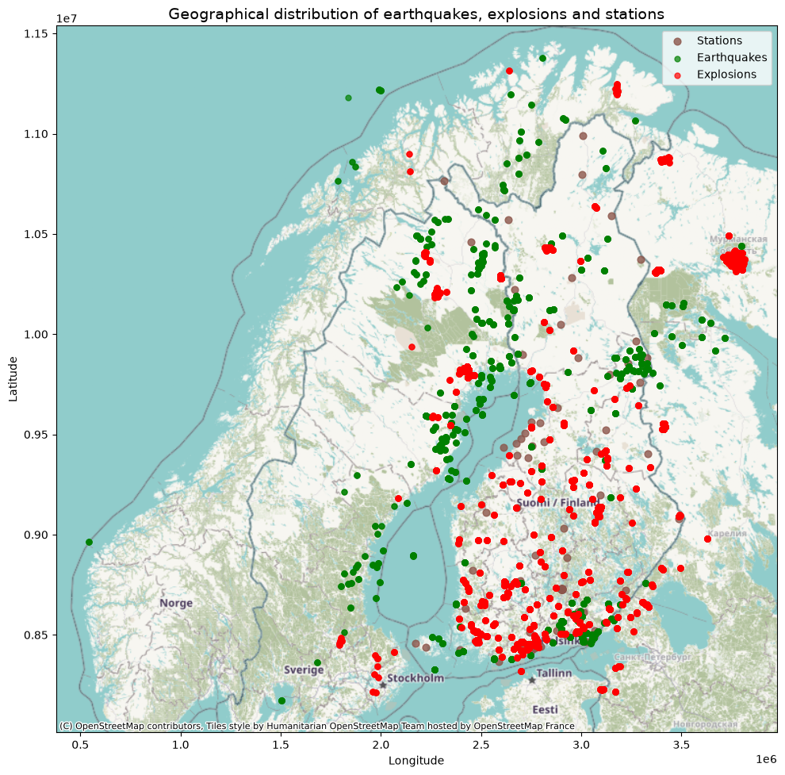
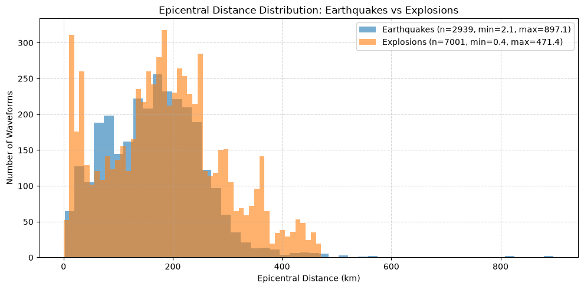
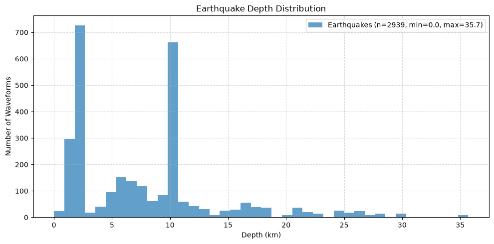
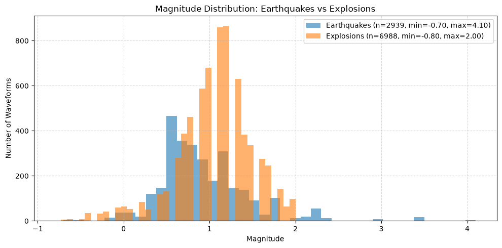
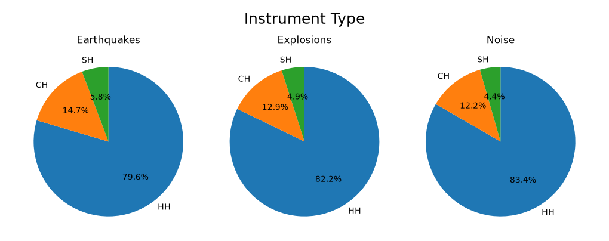

# Dataset Summary
This report describes the Finnish dataset used in EQcomp.

# Overview
The Finnish seismic dataset consists of 3-component waveforms stored in `waveforms.hdf5`, along with its metadata in `metadata.csv`. Each waveform is either created by an earthquake or an explosion, or does not measure any event at all. The latter is considered a noise waveform to provide a negative class for model finetuning.

Almost all waveforms originated from the FN and HE networks, with a small number from UP. The earthquakes and explosions took place in Finland, Sweden, Norway, Estonia, and Russia.

## Data extraction

Manual picks were extracted from the QuakeML catalogs provided by the Institute of Seismology at the University of Helsinki, which can be found in the eqdet repository. 

During extraction, "MSG" phases, which are used for magnitude calculations, were ignored. The suffixes of phases such as ’PG’, ’PB’, ’PN’, ’SG’, ’SB’, and ’SN’ indicated the depth of the crust at which the waves had travelled. These phases were treated simply as P or S picks.

Each window is 60 seconds long, matching STEAD and ensuring compatibility with EQCCT and EQTransformer. 

Windows contain one or both P/S picks; if picks were too far apart, separate windows were created. Windows containing picks associated from multiple events were not downloaded. There is a 5 second buffer before the first pick in the window, and at least a 5 second buffer after the last pick. The waveforms were left unprocessed in case the candidate phase pickers had their specific pre-processing procedures. 

Noise windows were generated via rejection sampling within 1 Jan to 28 Feb 2025, ensuring no overlap with known events. Stations were uniformly sampled from those active within the same time period and only station-window combinations free of events were retained.

# Dataset statistics

| event_type   |   num_events |   num_waveforms | first_waveform_start             | last_waveform_end                |
|:-------------|-------------:|----------------:|:---------------------------------|:---------------------------------|
| earthquakes  |          322 |            2939 | 2025-01-01 09:21:27.310 | 2025-12-30 13:23:52.936 |
| explosions   |          598 |            7001 | 2025-01-02 09:16:36.816 | 2025-02-28 21:49:44.800 |
| noise        |            0 |           12716 | 2025-01-02 09:56:04.130 | 2025-02-28 21:44:17.020 |

